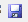
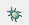

# SNT, Activité 02 : compléter la génération d'une page web

## 1. Code initial
Pour cette activité, récupérez (téléchargement ou en copier-coller) : [le code python initial (fichier 02_carte.py)](02_carte.py) 

Pour cela : ouvrez Thonny et dans ce logiciel, ouvrez le fichier téléchargé ou copier le code dans un nouveau fichier.
Quand vous modifiez le fichier, pensez à sauvegarder (CTRL+S ou le bouton )

C'est le code de l'activité 1, mais il a été complété. 
Exécutez ce script en utilisant "Déboguer le script courant", c'est le bouton avec l'image . Puis utilisez "entrez dans l'étape en cours (F7)" , ceci permet de voir le dérouler du programme.

Répondons collectivement aux questions suivantes, en prenant note des réponses. 

## 2. Obervons quelques différences entre la 1re activité et la 2e

### 2.1 Retrouvez les 2 conversions de types qui transforment une chaine de caractères en un "réel", semblables à ce que nous venons de voir.
### 2.2 Jetez un œil sur la documentation du service en ligne qui permet la conversion de la latitude et de la longitude en image. 

L'adresse web de cette documentation est [https://wiki.openstreetmap.org/wiki/Slippy_map_tilenames](https://wiki.openstreetmap.org/wiki/Slippy_map_tilenames)

### 2.3 Comment s'appelle le fichier qui est créé (ou écrasé) par le script ? Où est-il ? 
### 2.4 À quoi servent les \n et \t ?
### 2.5 Observez à quoi ressemble du html, nous y reviendrons dans le cadre d'un autre thème

## 3. Modifions un peu le code

### 3.1 Plutôt que d'écrire une valeur "fixe" de l'adresse, utilisez input en début de script pour que l'utilisateur tape les 3 éléments de l'adresse
### 3.2 Plutôt que d'afficher une seule image dans le fichier html, modifier le code pour afficher 9 images
Les 9 images sont "centrées" sur l'image. Si on considère x, y les "coordonnées" de l'image, il faudra : 
 - l'image x-1 , y-1
 - l'image x, y-1 
 - l'image x+1, y-1
 - l'image x-1, y
 - l'image x, y
 - l'image x+1, y
 - l'image x-1, y+1
 - l'image x, y+1
 - l'image x+1, y+1
vous pouvez faire en écrivant 9 lignes (la 5e étant déjà écrite) ou en faisant une (ou deux) boucle for

Relancez le programme et ouvrez la page générée. Que constatez-vous ?

### 3.3 Ajoutez à la page web généré le style en mettant (dans le script) entre les deux balises <head> </head> le code html suivant :  

```html
<link rel="stylesheet" href="style-carte.css">
```
Pensez bien aux \" si nécessaire (et au \n pour rendre le fichier html lisible) et à placer le fichier [style-carte.css](style-carte.css) à côté de votre fichier python.
Relancez le programme et ouvrez la page générée. Que constatez-vous ?


