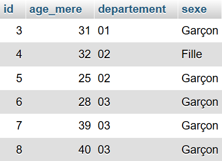

# Activité 10 : Base de données (opération sur les données)

Pour cette activité, nous allons nous appuyer sur les pages 20 et 21 du manuel "SNT" édition Delagrave. Notez sur une feuille les réponses aux questions suivantes : 

## 1. Quels sont les plats rapides à préparer ? Quelle recette choisir pour faire un dessert sans œuf, sans gluten et rapide à préparer ?. (question du manuel)

## 2. Quelle modification apporter à la requête pour obtenir les codes de départements de la région Normandie  (question du manuel)

## 3. Comment s’écrirait la requête du document 2 en SQL ? (question du manuel)

`À lire : ` Pour la suite, considérons qu'une partie des données naissances de 2021 a été insérée dans une base de données, comme illustré par la figure ci-dessous : 



## 4. Quelles sont les descripteurs de ces données ? 

`À lire : ` une requête SQL s'écrit de cette façon : 

```sql
SELECT 'ce que l on veut obtenir' FROM 'la table des donnés sources' WHERE 'un ou plusieurs cirtères de sélection' ORDER BY 'un descripteur'
```

où : 
 - ```'ce que l on veut obtenir'``` peut être : * (tous les descripteurs), une liste de descripteur et/ou une fonction (AVG pour moyenne, COUNT, SUM, MIN, MAX)
 - ```'la table des donnés sources'``` est le nom de la table "explorée"
 - ```'un ou plusieurs cirtères de sélection'``` c'est comme en python et les "if", il s'agit ici de préciser une condition (ou plusieurs reliées avec des AND / OR / NOT). Une condition est du style "descripteur = valeur", avec =, <, <=, >, >=, <> (pour différent), etc.


## 5. Écrivez et proposez des requêtes pour : 1) comptez les naissances en 2021 et 2) avoir l'âge moyenne des mères

## 6. Écrivez et proposez des requêtes pour : 1) avoir le nombre de naissances dans la Drôme en 2021 2) le nombre de garçons nés en 2021 dans la Drôme

## 7. Écrivez et proposez des requêtes pour : 1) avoir le nombre de naissances dans la région ARA en 2021 2) le nombre de garçons nés en 2021 dans  la région ARA

Rappel : voici la liste des départements de la région ARA, "01", "03", "07", "15", "26", "38", "42", "43", "63", "69", "73", "74"