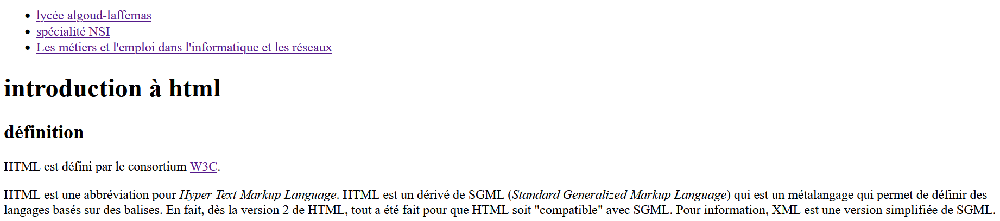

# Activité 15 : Refaire une page

L'objectif de cette activité est de refaire une page web. Un aperçu est disponible avant les indications.

## Aperçu de la page




## indications

Éditez la page web « arefaire.html » à l’aide d’un éditeur de texte (notepad++ par exemple ou autre selon ce qui est installé sur vos PC).
Ne retapez pas tout le texte : faites des copiers-collers à partir du texte ci-dessous, donné après les indications. 
Mais attention, il faudra ajouter les balises et leurs attributs.
La structure générale du document est un ```<header>``` et une ```<section>```.

## header
La partie « entête » du corps du document est encapsulée dans une balise ```<header>```. Elle est composée : 
 - D'une balise ```<nav>``` contenant une liste non ordonnée (= balise ```<ul>```) avec 3 item (= balise ```<li>```) qui sont quatre liens. Les adresses des liens sont, dans l’ordre :
   - https://algoud-laffemas.ent.auvergnerhonealpes.fr/
   - https://www.education.gouv.fr/reussir-au-lycee/la-specialite-numerique-et-sciences-informatiques-au-bac-325448
   - https://www.onisep.fr/metier/decouvrir-le-monde-professionnel/informatique-et-reseaux/les-metiers-et-l-emploi-dans-l-informatique-et-les-reseaux
 - du titre de niveau 1 (= balise ```<h1>```) de la page.

## section
La section correspond à une balise ```<section>```. Elle est constituée : 
 - D’un entête (= balise <header>) contenant un titre de niveau 2 (= balise ```<h2>```)
 - Puis de deux paragraphes (= balise ```<p>```). 
    - Dans le 1er paragraphe, le lien cible la page http://www.w3c.org 
    - Il faut noter les abréviations (en majuscules) par la balise ```<abbr>``` et leur signification par la balise ```<dfn>``` (définition). 

## Texte "brut" (pour faire les copiers-collers)

```txt
    lycée algoud-laffemas
    spécialité NSI
    Les métiers et l'emploi dans l'informatique et les réseaux

introduction à html
définition

HTML est défini par le consortium W3C.

HTML est une abbréviation pour Hyper Text Markup Language. HTML est un dérivé de SGML (Standard Generalized Markup Language) qui est un métalangage qui permet de définir des langages basés sur des balises. En fait, dès la version 2 de HTML, tout a été fait pour que HTML soit "compatible" avec SGML. Pour information, XML est une version simplifiée de SGML.
```


