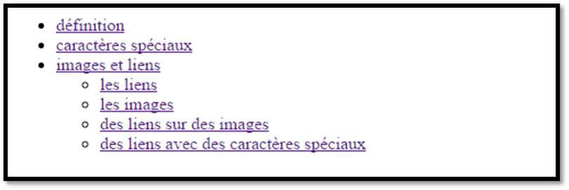

# Activité 16 : Table des matières et image cliquable

## Table des matières

Dans le fichier [toc_source.html](toc_source.html), l’objectif est d’y insérer une table des matières semblable à l'image ci-dessous :



Dans l’entête (```<header>```) du fichier toc_source.html, la balise <nav> est vide. Complétez-la avec une table des matières. 
Celle-ci sera une liste avec comme item les titres de niveau 2. Si des sous-titres existent (des ```<h3>``` après un ```<h2>```) 
lors faites une sous-liste pour ces sous-titres. Chaque item est un lien vers un titre de niveau 2 ou 3 (ou la section ou l’article correspondant) du document. 
Il vous revient d’ajouter des attributs id si-nécessaire. 


## Image cliquable

Récupérez les fichiers (clic droit sur les liens > enregistrer sous): 
 - [France.html](France.html)
 - [france.png](france.png)

Faites-en sortes que l'on puisse cliquer sur certains départements pour aller sur leur site web. Pour cela, il faudra compléter la ```<map>``` avec des ```<area>```.
Ces ```<area>``` seront les liens (c.f. l’exemple en ligne [http://dabblet.com/gist/9cc7e3b0cdf7eb4c6a12](http://dabblet.com/gist/9cc7e3b0cdf7eb4c6a12) ). 
La ```<map>``` et l’image  ```<im>``` sont reliées par l'attribut usemap de l'image dont la valeur correspond à l'attribut id pour la ```<map>```. 
Pour les areas, il est demandé d’avoir les attributs suivants :
 - alt (le nom du département), 
 - title (le nom du département), 
 - href (le site web du département), 
 - tabindex (égal au numéro du département) et
 - shape et coords pour définir la zone cliquable

Voici la liste des départements :
 - la Lozère (48) avec un cercle (shape = "circle") dont le centre est (325,386) et un rayon de 20 (ce sont les valeurs pour coords). 
    - Le site web est à http://lozere.fr/
 - le Finistère (29) avec un rectangle (shape = "rect") dont le coin en haut à gauche est (4,123) et le coin en bas à droite est (46,177) (ce sont les valeurs pour coords).
    - Le site web est à http://www.finistere.fr/ 
 - pour la suite, shape = "poly" et coords est la liste des points
 - les Alpes Maritimes (06) avec un polygone composé des points (470,398), (482,405), (495,405), (502,402), (505,405), (497,414), (496,424), (482,436), (478,441), (475,442), (465,428), (466,422), (476,417), (464,404) et (470,398).
    - Le site web est à https://www.departement06.fr/
 - l’Isère (38) avec un polygone composé des points (395,310), (403,309), (423,331), (435,331), (443,348), (442,360), (420,370), (411,366), (413,352), (400,352), (400,350), (395,339), (380,334), (380,329), (395,320) et (395,310)
    - Le site web est à http://www.isere.fr/ 
 - le Doubs (25) avec un polygone composé des points (419,221), (456,204), (466,215), (443,238), (443,249), (434,258), (431,254), (436,250), (436,244), (431,239), (419,234), (423,227) et (419,221).
    - Le site web est à http://www.doubs.fr/ 

